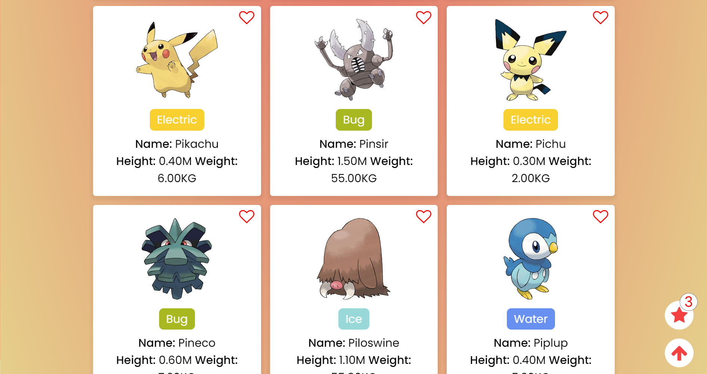
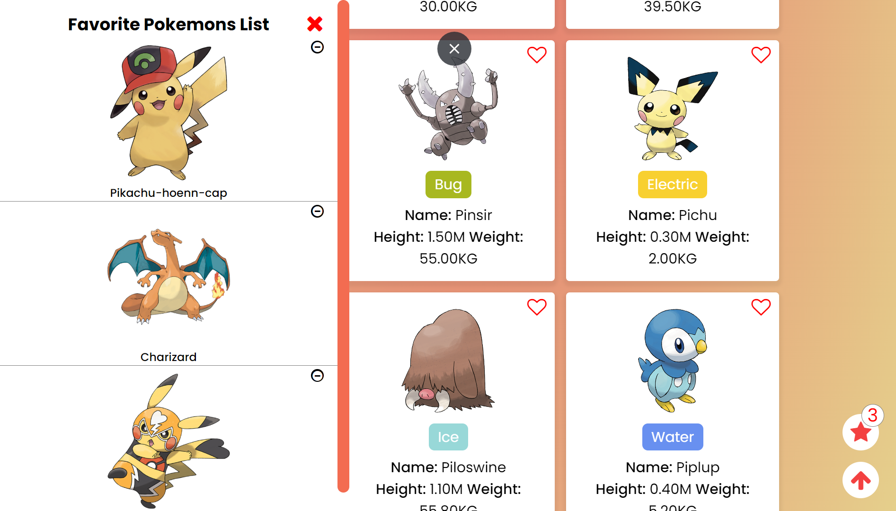

# Pokedex
We are Ash Ketchum from Palate town and our goal is to become a master pokemons! \
**Can you Catch'Em All?** -
[Pokedex (Please click on the main site's title - it's a surprise)](https://aqueous-thicket-83962.herokuapp.com/):point_left:

## About
This is Cyber4s middle program project. \
The main goal of this project was to program a scalable web app that had a large database and could serve many users. \
In the begining of this project we used a MongoDB database and we had to create a database of 1 million merged pokemons. \
During the development process, we were asked to make a migration between MongoDB and PostgreSQL database and kept only 10,000 pokemons. 

## What I have learnd?
1. How create server-side by creation meaningful routes and controllers.
2. How create MongoDB and PostgreSQL database and how make a migration between them.
3. How to create client-server-database integration by smart client serving. \
The client get his data in chunks (by pagination approach) and not all at once.
4. How to create Vanila TypeScript components in React.js way.


## Technologies:

 **Front-End**:
- **[TypeScript](https://www.typescriptlang.org/)**
- **[Sass](https://www.npmjs.com/package/sass)**
  
 **Back-End**:
- **[Express](https://www.npmjs.com/package/express)**
- **[PostgreSQL](https://www.postgresql.org/)**
- **[mongoDB](https://www.mongodb.com/)**

**Misc**:
- **[Webpack](https://webpack.js.org/)**
- **[ESlint](https://eslint.org/docs/latest/user-guide/configuring/)**


## Installation

1. **Clone the repo**
   ```
   git clone git@github.com:rom-orlovich/Pokedex.git
   ```
2. **Install all the dependencies**
   ```
    npm ci
   ```
3. **Run server**
   ```
   npm run server
   
   ```
4. **Run Client**

   ```
   npm run start
   ```

5. **Go to http://localhost:3000 and have fun**!

## Main Feautres:
1. **Infinte-Scrolling** - Every time the user scrolls to the bottom of the page, the client fetches more results. There is a scroll up button
2. **Filter Search** - The user able to filter the pokemons by their names.
3. **Favoirte pokemons** - The user can create and remove his favorite pokemons list.


## Images: 




## Contributors:
* [rom-orlovich](https://github.com/rom-orlovich)
* [naornahum](https://github.com/naornahum)


